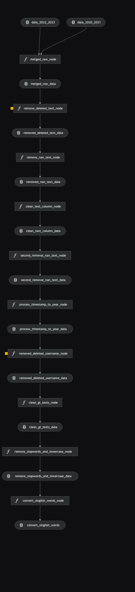

# kedro_data

## Pipeline Architecture



## Overview

This is your new Kedro project with Kedro-Viz setup, which was generated using `kedro 0.19.8`.

Take a look at the [Kedro documentation](https://docs.kedro.org) to get started.

## Rules and guidelines

In order to get the best out of the template:

- Don't remove any lines from the `.gitignore` file we provide
- Make sure your results can be reproduced by following a [data engineering convention](https://docs.kedro.org/en/stable/faq/faq.html#what-is-data-engineering-convention)
- Don't commit data to your repository
- Don't commit any credentials or your local configuration to your repository. Keep all your credentials and local configuration in `conf/local/`

## How to Run Your Kedro Pipeline

1. Navigate to the `data/01_raw` folder of the project:

   Add the following data files:

   - `Reddit-Threads_2020-2021.csv`
   - `Reddit-Threads_2022-2023.csv`

2. Run the entire Kedro project:

   ```python
   kedro run
   ```

3. Run a specific pipeline:

   ```python
   kedro run --pipeline="pipeline-name"
   ```

4. (Optional) Run a specific node:

   ```python
   kedro run --nodes="node-name”
   ```
