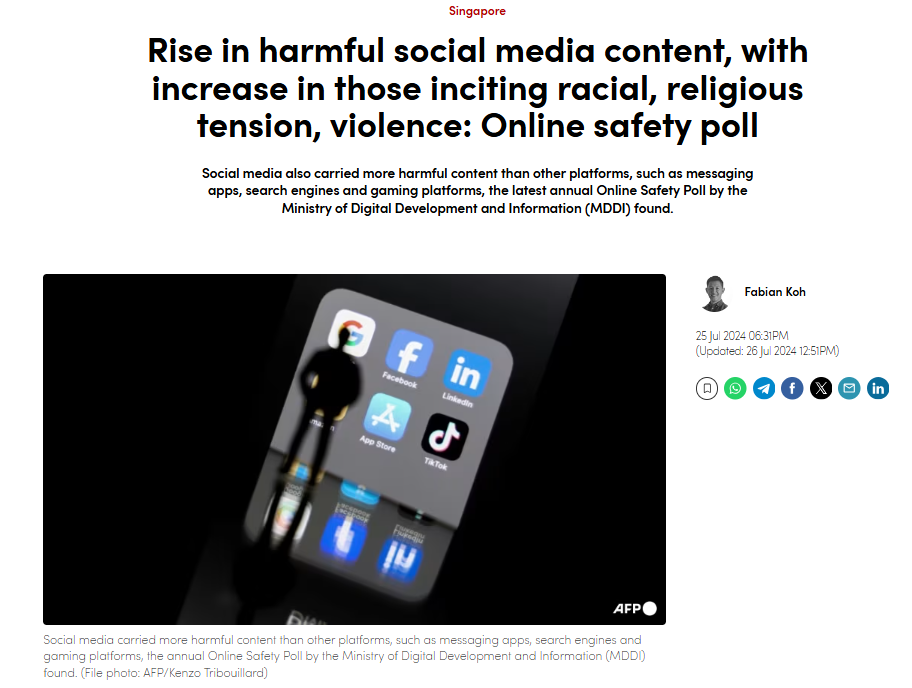

# Context

## 1. Overview of Online Safety Concerns on Social Media

In recent years, social media platforms have increasingly become spaces where discussions can become toxic and polarised. This phenomenon poses significant risks, particularly in multicultural societies like Singapore, where diverse viewpoints can clash more intensely in online spaces. The widespread use of social media and the anonymous nature of some platforms, like Reddit, can amplify such hatefulness and toxicity, affecting the digital experience for many users and potentially influencing social cohesion.

## 2. Growing Concerns in Singapore

Singapore, as a multi-racial, multi-religious, and highly connected society, faces unique challenges in managing the effects of hate speech and toxicity on social media. The increasing accessibility of the internet to younger users adds urgency to this issue, as children and adolescents are particularly vulnerable to harmful online content. An [Online Safety Poll](https://www.mddi.gov.sg/mddi-survey-two-thirds-of-respondents-encountered-harmful-online-content/) conducted by the Ministry of Digital Development and Information (MDDI) in April 2024 (Figure 1) underscores this, showing a concerning rise in harmful content exposure, with 66% of respondents encountering harmful content, up from 57% the previous year. Therefore, there is a growing concern and hence an urgent need to curb the issue of rising hate and toxic speech in the online environment.

Figure 1. News article on Online Safety Poll conducted by MDDI

