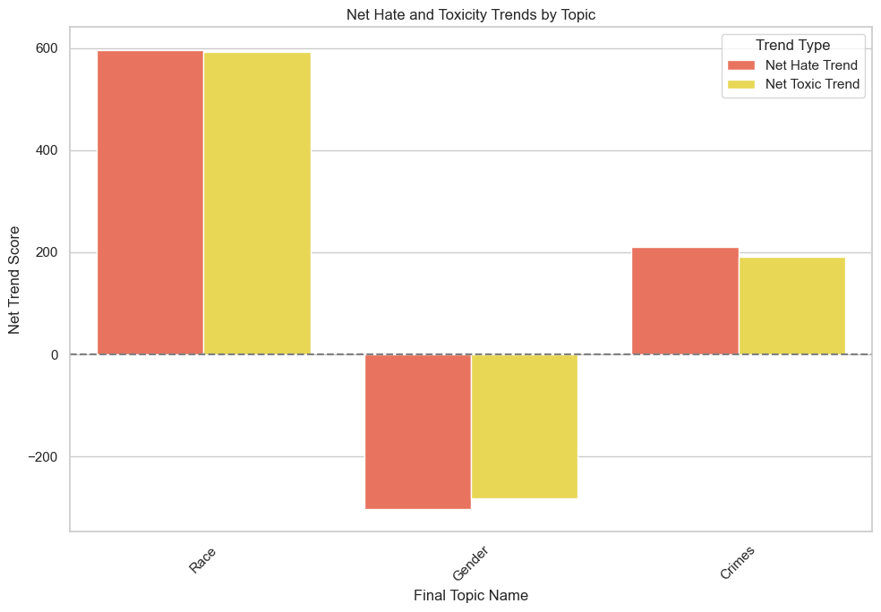

# Findings

## 1. Results

<!-- _In this subsection, you should report the results from your experiments in a summary table, keeping only the most relevant results for your experiment (ie your best model, and two or three other options which you explored). You should also briefly explain the summary table and highlight key results._ -->

### 1.1 Classification Model Results

<table style="border-collapse: collapse; width: 100%;">
    <thead>
        <tr>
            <th style="border: 1px solid lightgrey; padding: 8px;"></th>
            <th style="border: 1px solid lightgrey; padding: 8px;">Ridge</th>
            <th style="border: 1px solid lightgrey; padding: 8px;">Ridge 5k</th>
            <th style="border: 1px solid lightgrey; padding: 8px;">XGBoost</th>
            <th style="border: 1px solid lightgrey; padding: 8px;">DistilBERT old</th>
            <th style="border: 1px solid lightgrey; padding: 8px;">DistilBERT 5k</th>
            <th style="border: 1px solid lightgrey; padding: 8px;">DistilBERT</th>
        </tr>
    </thead>
    <tbody>
        <tr>
            <td style="border: 1px solid lightgrey; padding: 8px;">No Hate/Toxic</td>
            <td style="border: 1px solid lightgrey; padding: 8px;">0.67</td>
            <td style="border: 1px solid lightgrey; padding: 8px;">0.61</td>
            <td style="border: 1px solid lightgrey; padding: 8px;">0.65</td>
            <td style="border: 1px solid lightgrey; padding: 8px;">0.45</td>
            <td style="border: 1px solid lightgrey; padding: 8px;">0.63</td>
            <td style="border: 1px solid lightgrey; padding: 8px;">0.72</td>
        </tr>
        <tr>
            <td style="border: 1px solid lightgrey; padding: 8px;">Toxic 1</td>
            <td style="border: 1px solid lightgrey; padding: 8px;">0.57</td>
            <td style="border: 1px solid lightgrey; padding: 8px;">0.54</td>
            <td style="border: 1px solid lightgrey; padding: 8px;">0.52</td>
            <td style="border: 1px solid lightgrey; padding: 8px;">0.21</td>
            <td style="border: 1px solid lightgrey; padding: 8px;">0.36</td>
            <td style="border: 1px solid lightgrey; padding: 8px;">0.61</td>
        </tr>
        <tr>
            <td style="border: 1px solid lightgrey; padding: 8px;">Toxic 2</td>
            <td style="border: 1px solid lightgrey; padding: 8px;">0.78</td>
            <td style="border: 1px solid lightgrey; padding: 8px;">0.40</td>
            <td style="border: 1px solid lightgrey; padding: 8px;">0.42</td>
            <td style="border: 1px solid lightgrey; padding: 8px;">0.34</td>
            <td style="border: 1px solid lightgrey; padding: 8px;">0.39</td>
            <td style="border: 1px solid lightgrey; padding: 8px;">0.79</td>
        </tr>
        <tr>
            <td style="border: 1px solid lightgrey; padding: 8px;">Toxic 3</td>
            <td style="border: 1px solid lightgrey; padding: 8px;">0.99</td>
            <td style="border: 1px solid lightgrey; padding: 8px;">0.60</td>
            <td style="border: 1px solid lightgrey; padding: 8px;">0.68</td>
            <td style="border: 1px solid lightgrey; padding: 8px;">0.08</td>
            <td style="border: 1px solid lightgrey; padding: 8px;">0.98</td>
            <td style="border: 1px solid lightgrey; padding: 8px;">0.98</td>
        </tr>
        <tr>
            <td style="border: 1px solid lightgrey; padding: 8px;">Hate 1</td>
            <td style="border: 1px solid lightgrey; padding: 8px;">0.74</td>
            <td style="border: 1px solid lightgrey; padding: 8px;">0.70</td>
            <td style="border: 1px solid lightgrey; padding: 8px;">0.73</td>
            <td style="border: 1px solid lightgrey; padding: 8px;">0.40</td>
            <td style="border: 1px solid lightgrey; padding: 8px;">0.77</td>
            <td style="border: 1px solid lightgrey; padding: 8px;">0.79</td>
        </tr>
        <tr>
            <td style="border: 1px solid lightgrey; padding: 8px;">Hate 2</td>
            <td style="border: 1px solid lightgrey; padding: 8px;">0.97</td>
            <td style="border: 1px solid lightgrey; padding: 8px;">0.87</td>
            <td style="border: 1px solid lightgrey; padding: 8px;">0.91</td>
            <td style="border: 1px solid lightgrey; padding: 8px;">0.60</td>
            <td style="border: 1px solid lightgrey; padding: 8px;">0.94</td>
            <td style="border: 1px solid lightgrey; padding: 8px;">0.97</td>
        </tr>
        <tr>
            <td style="border: 1px solid lightgrey; padding: 8px;">Hate 3</td>
            <td style="border: 1px solid lightgrey; padding: 8px;">0.99</td>
            <td style="border: 1px solid lightgrey; padding: 8px;">0.99</td>
            <td style="border: 1px solid lightgrey; padding: 8px;">0.94</td>
            <td style="border: 1px solid lightgrey; padding: 8px;">0.57</td>
            <td style="border: 1px solid lightgrey; padding: 8px;">0.99</td>
            <td style="border: 1px solid lightgrey; padding: 8px;">0.99</td>
        </tr>
        <tr>
            <td style="border: 1px solid lightgrey; padding: 8px;"><b>Macro Avg F1-score</b></td>
            <td style="border: 1px solid lightgrey; padding: 8px;"><b>0.81</b></td>
            <td style="border: 1px solid lightgrey; padding: 8px;"><b>0.72</b></td>
            <td style="border: 1px solid lightgrey; padding: 8px;"><b>0.81</b></td>
            <td style="border: 1px solid lightgrey; padding: 8px;"><b>0.39</b></td>
            <td style="border: 1px solid lightgrey; padding: 8px;"><b>0.72</b></td>
            <td style="border: 1px solid lightgrey; padding: 8px;"><b>0.84</b></td>
        </tr>
    </tbody>
</table>

Table 3: Model Experimentation Results comparing macro-average F1-scores between different classifier models. Model names with "5k" indicate that the model was trained on a smaller dataset containing less synthetic data that we generated to balance the classes. DistilBERT old was trained on data labelled with a previous version of class defintions that made classes less distinct from each other.

DistilBERT achieved the highest F1-score (0.84), making it the top-performing model. Models trained on the smaller 5k dataset (a mix of [synthetic](../technical_report/methodology/modelling/model1.md#1-data-generation) and actual labeled data), and in certain synthetically generated classes showed lower F1-scores, indicating that the reduced dataset may lack the nuanced variations found in real-world text, which are crucial for effective hate and toxic speech detection. DistilBERT old, trained with a less precise set of class definitions, had the lowest macro-average F1-score (0.39), underscoring the importance of the updated, distinct class definitions in improving the training performance of our classifier.

### 1.2 Topic Modelling Results

Topic modeling identified rising themes in hate and toxicity across key topics: race, crime, and gender. More in-depth analysis can be found [here](https://joytsy.github.io/DSA4264-Detoxify/home/technical_report/appendix/).

Race has emerged as the most pressing issue among the three categories analyzed, with the highest increase in both [Net Hate and Net Toxicity Scores](../technical_report/methodology/modelling/model2.md#51-trend-calculation), reflecting a significant rise in intensity levels up to 2024. This issue has proven to be both recurring and deeply rooted in society. Given that many of the problems identified are ongoing, policymakers must prioritize addressing them. Additionally, a large portion of high-intensity comments stems from this topic, underscoring the need for targeted interventions to tackle the growing hate and toxicity in this area.
Graph showing Net Hate and Toxicity trends of the 3 Topics from 2020-2023.

This methodological approach, utilizing advanced topic modeling techniques and thematic analysis, serves to reveal insights into the shifting landscapes of discourse on Reddit. By examining the frequency and context of topics associated with toxic and hateful sentiments, we aim to use our methodology to uncover the underlying trends and catalysts contributing to the increase in toxicity and hate in social media on a larger scale in future.

Graph showing Net Hate and Toxicity trends of the 3 Topics from 2020-2023

This methodological approach, utilizing advanced topic modeling techniques and thematic analysis, serves to reveal insights into the shifting landscapes of discourse on Reddit. By examining the frequency and context of topics associated with toxic and hateful sentiments, we aim to use our methodology to uncover the underlying trends and catalysts contributing to the increase in toxicity n hate in social media on a larger scale in future.

## 2. Discussion

### 2.1 Classtification Modelling Insights

The results provide valuable insights for safeguarding digital safety, with the multiclass text classifier effectively classifying hate and toxicity based on intensity. Topic modeling further contextualizes the classifier’s findings, highlighting specific social issues that drive hate and toxicity—information that can guide targeted intervention and more nuanced policy solutions.

For [MDDI’s Online Trust and Safety department](../technical_report/scope.md#11-problem-faced-by-mddi), these insights enable actionable responses to the key themes and comments identified as severe, directly from our data science solutions. The results from our methods go beyond [capturing increased frequency of hateful and toxic topics](../technical_report/methodology/modelling/model2.md#4-analysis-of-hate--toxic-frequency-for-topics), to further prioritize topics based on [intensity metrics that capture heightened hate and toxicity](../technical_report/methodology/modelling/model2.md#5-analysis-of-hate-and-toxic-intensity-for-topics) using our [measures to calculate intensity](../technical_report/methodology/modelling/model2.md#51-trend-calculation).

However, certain limitations remain that influence the model’s real-world effectiveness and should be considered when deploying the solution:

**Class Imbalance**: Despite efforts to address class imbalance through oversampling, SMOTE, and class weighting, categories such as Hate 3 (threats and violence) and Toxic 3 (harassment) remained underrepresented. This imbalance affects the model’s ability to accurately classify these minority classes, leading to lower performance metrics in critical areas of concern. For MDDI, this translates to potential risks in effectively capturing the most severe forms of online harm, where a single undetected instance of hate or harassment may have significant negative impact. Hence, we approached the problem with [synthetic data generation](../technical_report/methodology/modelling/model1.md#1-data-generation).

**Singlish and Language Nuances**: The diverse linguistic patterns in Singlish posed unique challenges. Non-standard grammar and culturally-specific terms were often misclassified. However, we tried to mitigate this issue by using [multilingual distilBERT](../technical_report/methodology/modelling/model1.md#2-distilbert-model) that works well on the individual languages. This challenge limits the model’s interpretability and accuracy for multilingual communities and highlights the importance of adapting language models to language and cultural nuances, which could value-add by improving precision in such contexts.

**Complexity of Analysis**: Comments that may fall into more than one topic category were only put them into one through BERTopic. This could cause relevant comments to be left out, limiting the precision of our intervention. Through the items we showcase in our frontend application, [LionGuard Pro Max](../technical_report/methodology/application/index.md#343-filtered-comments), we aim to enable clarity to users by displaying actual comments within each cluster.

**Granularity of Analysis**: The model, while effective in broadly classifying hate and toxic content, lacks the capacity to provide subgroup-level insights. This limitation restricts MDDI's ability to drill down into specific user subgroups, such as frequent offenders or communities where harmful content is concentrated, reducing the precision of targeted interventions. An enhancement that segments comments by user or community could support more customized approaches to harm reduction, enhancing digital safety.

Enhanced interpretability would allow MDDI to better understand model outcomes, while addressing class imbalance and cultural language nuances would improve fairness in content moderation. A continued focus on addressing these areas could lead to more reliable and equitable digital safety solutions in future iterations.

### 2.2 Topic Modelling Insights

Following our analysis of hate and toxic trends, we identified three pressing issues: gender biases, racial tensions, and youth-involved crimes. These concerns reflect broader societal challenges tied to deeply embedded perceptions.

The rise of “racial privilege” highlights systemic advantages for the Chinese majority, sparking debates about inclusivity and causing increased toxicity trends. There has also been a rise in xenophobia, particularly towards Chinese nationals, further exacerbating racial tensions. Calls for greater inclusivity and equal representation have been growing, as many feel that minority voices and needs are not adequately addressed.

Similarly, the issue of sexual and youth-related hate crimes has become a heated topic, with the public criticizing perceived leniency in sentencing. Instances of youth offenders receiving light sentences for serious offenses, such as sexual crimes, have led to public calls for stronger judicial responses. There is a widespread demand for the legal system to align more closely with the severity of these crimes to ensure that justice is served and to prevent further harm.

In terms of gender issues, the toxicity surrounding gender discussions had been on the decline until recently, when dissatisfaction surrounding National Service (NS) and toxic masculinity led to increased negative discourse. Public frustration grew over gender perceptions and stereotypes, with some expressing resentment towards gender equality movements. This fueled hate and gender biases, particularly targeting women and reinforcing harmful gender stereotypes.

## 3. Recommendations

### 3.1 Improvements for Classification Modelling

To enhance and expand our solution for MDDI's Online Trust and Safety initiatives, we propose several future directions that address current limitations and broaden the utility of the model:

1. Model Improvements: Fine-tuning the multilingual DistilBERT model with more diverse datasets could improve its sensitivity to nuances like Singlish and help address the underrepresentation of certain toxic categories. Additionally, exploring more advanced transformer-based models, such as XLM-RoBERTa, could strengthen performance across multilingual contexts and provide better classification accuracy, particularly for minority classes like Hate 3 and Toxic 3.
2. Broader Application: Extending the model's applicability beyond Reddit to other platforms, such as Twitter, Facebook, and YouTube, would offer a broader perspective on harmful content trends and enhance the model's ability to capture patterns across various social media ecosystems. This cross-platform approach would enable MDDI to monitor and respond to toxic behavior trends more effectively, creating a more cohesive digital safety strategy.
3. Explainability: Integrating explainable AI techniques would provide clearer insights into the reasons behind each classification. This added interpretability would help moderators, policymakers, and other stakeholders trust and utilize the model as a decision-support tool, reducing the opacity of the "black-box" nature often associated with machine learning models.
4. Real-Time Monitoring and Intervention: Developing capabilities for real-time monitoring would enable the system to flag and address harmful content immediately as it’s posted. This proactive approach would allow for timely interventions, such as issuing warnings or suspending accounts, thereby preventing the escalation of toxic discussions and providing a safer online environment.

These recommended directions align with the goals of enhancing interpretability, fairness, and deployability, offering MDDI a scalable path forward in adapting the solution to meet emerging challenges in online safety.

### 3.2 Recommendations based on Topic Modelling

To address race, crime and gender being the most pressing issues, we propose several solutions in tackling hate and toxic speech.

For **race** related recommendations, it is essential to enhance community engagement by developing and implementing initiatives that foster cross-cultural understanding and empathy among different racial groups. This approach aims to reduce the toxicity often associated with racial discussions. Simultaneously, there is a need for continuous evaluation and refinement of policies such as the Ethnic Integration Policy (EIP). This can be achieved through collaboration with the relevant ministries. By ensuring these policies are fair and responsive to the needs of all communities, we can minimize the unintended negative impacts that may arise, thus allowing us to progress towards a more inclusive and harmonious society.

For **crime** related recommendations, educational campaigns that educate the public about cause and consequences of crimes, especially sexual crimes, are important. These campaigns should aim to shift the focus from a retribution-centric approach to one that emphasizes rehabilitation and prevention. Additionally, there is a need for judicial and sentencing reforms to adjust guidelines in a way that balances the severity of punishment with the potential for rehabilitation. Such reforms will ensure justice is served while also fostering opportunities for offenders’ reintegration into society, ultimately contributing to a safer and more understanding community.

For **gender** related recommendations, promoting inclusive dialogues is key. Facilitating open discussions to address misconceptions about gender roles and National Service can help highlight the contributions of all genders to national development. Alongside this, it is vital to implement initiatives that support emotional well-being, especially for men. Addressing issues of toxic masculinity and promoting healthier emotional expression can foster a more supportive environment where everyone feels valued and understood. Together, these efforts can pave the way for a more gender-inclusive society.

Together, these recommendations aim to promote understanding, empathy, and inclusivity in addressing race, crime, and gender issues, ultimately contributing to a more cohesive and supportive society.
