# Application

The following sections showcase the different pages and features of LionGuard Pro Max.

## 1. Home Page

The homepage of our application serves as a central hub for users to access important information and navigate to other pages seamlessly. On the homepage, users will be able to find out what our application does and its goals, followed by a quick overview of the application's key features.

Additionally, the homepage features a navigation bar on the left of the page, containing buttons for Home, Classify Text and Analysis. Clicking on any of these buttons will redirect users to the corresponding pages, allowing for easy navigation throughout the application.

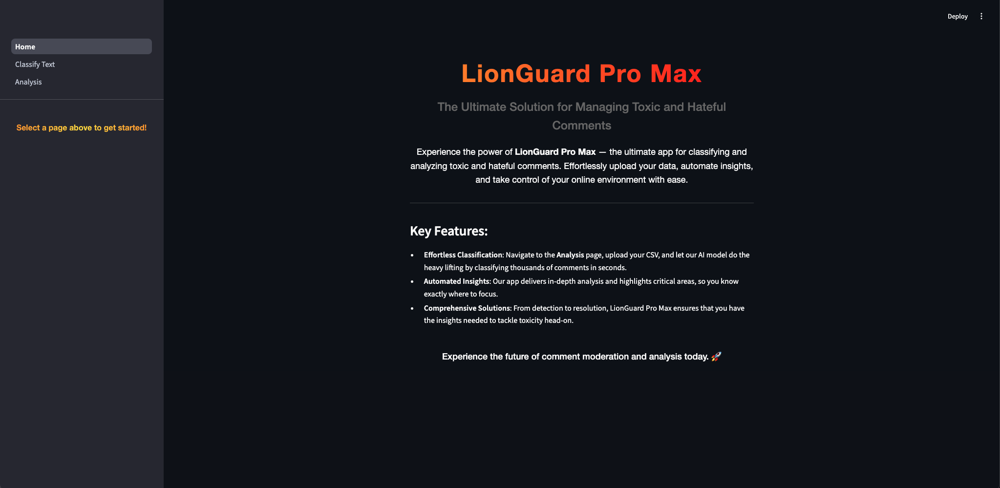

## 2. Classify Text Page

The Classify Text Page enables users to classify text via various methods, either by manual classification for singular testing of comments or by uploading a CSV dataset for multiple testing of comments at one time. Users can also view the history of their past classifications, and discover more about the model used in this application.

### 2.1 Classifying Text by Manual Classification

On the Classify Text page, there is a Manual Classification tab that enables users to manually classify a comment by typing it into the chatbox, before clicking the Classify button below the box.

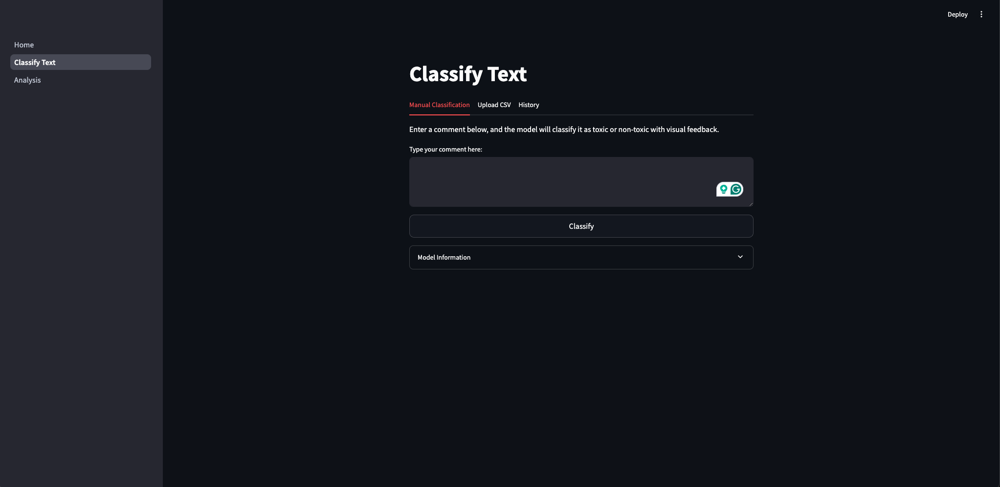

After clicking the Classify button, the predicted label will appear, thus showing the Language Intensity Classification of the comment. An example is shown below:

    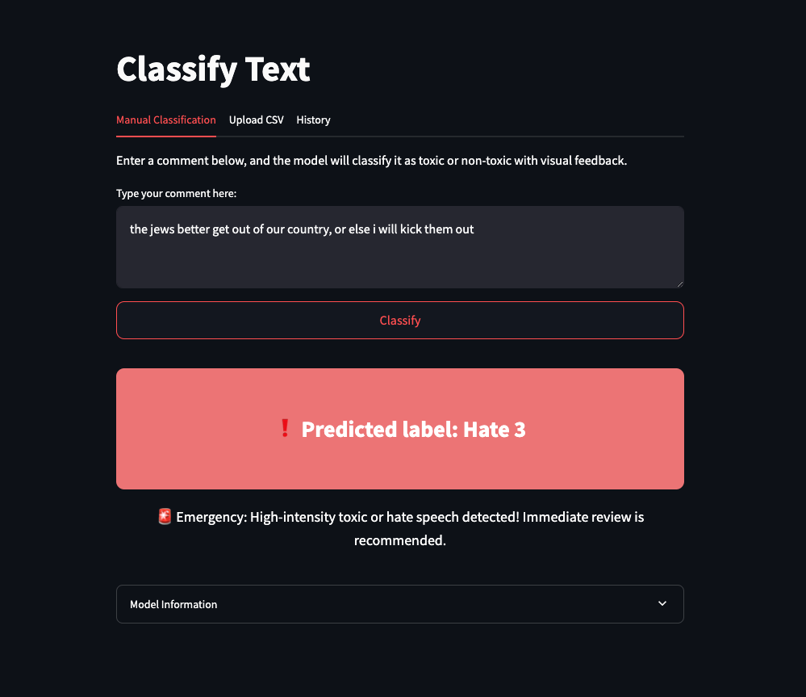

### 2.2 Classifying Text by Uploading CSV

Besides only being able to manually key in one comment at one time, users can upload a CSV file which enables them to test multiple comments at a go by clicking into the Upload CSV tab. The file can then be uploaded from the local device by clicking the Browse files button.

    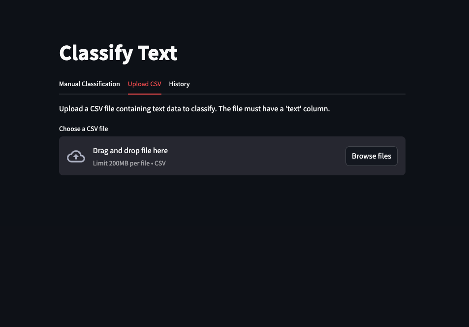

### 2.3 History Tab

Clicking into the History tab enables users to view their past classifications, allowing them to track and review their work.

    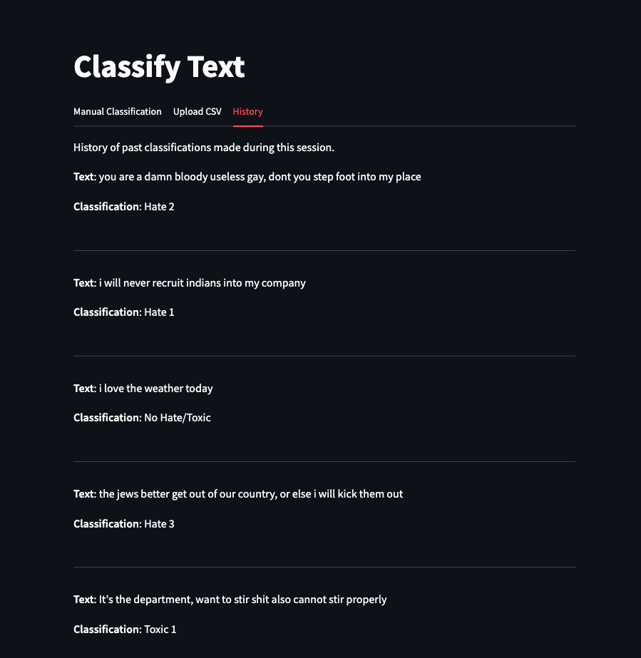

### 2.4 Model Information Section

The Model Information section provides users with comprehensive details, including the model powering the application backend, how we fine-tuned it, and clear definitions and descriptions for each of our 7 classification categories. This gives users insight into how the model interprets and categorizes data. By understanding the model's foundations and classification criteria, users can make more informed interpretations of its outputs and have confidence in the underlying technology.

    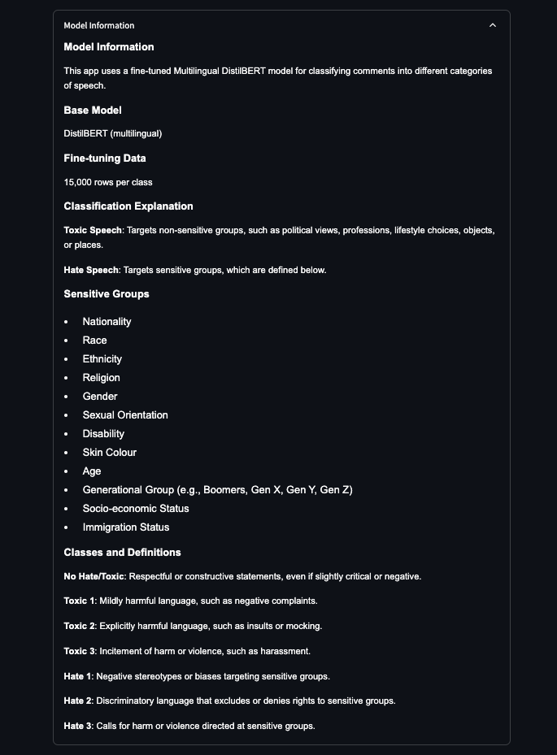

## 3. Analysis Page

This page provides a high-level summary of the data analysis conducted to examine hate and toxic speech in Singapore-related subreddits from 2020 to 2023. Our analysis aims to identify trends in the frequency and intensity of such language, highlighting any significant shifts over time. The findings presented here are designed to give insights into the prevalence and characteristics of online hate speech and toxicity within the Singaporean context.

### 3.1 Overview Tab

The Overview tab has a welcome message to our analysis dashboard, and provides an overview of the various tabs and their purpose.

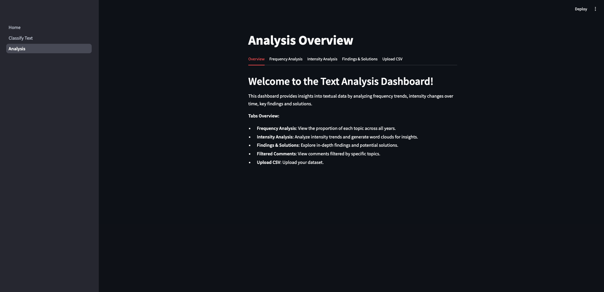

### 3.2 Upload CSV Tab

This tab allows users to upload a CSV file containing text data, formatted to match the input requirements of this analysis tool. The data should include key fields like timestamp, comment text, and any metadata pertinent to user engagement or subreddit categorisation. Once uploaded, the data is preprocessed and then analyzed to extract the metrics needed for frequency and intensity analyses.

    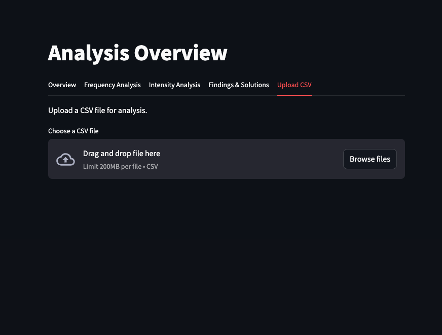

### 3.3 Frequency Analysis Tab

The Frequency Analysis tab presents a breakdown of the proportions of each of the 13 topics identified through topic modelling, displayed over the selected years. This analysis provides insights into the distribution and prominence of each topic, allowing users to observe how the prevalence of specific topics related to hateful or toxic language has shifted over time.

To the right of the bar graph, users can find configuration options that enable further customization of the vizualization:

**Year and Topic Selection:** Allows for flexible data exploration by enabling users to select specific years or view data for all available years. Similarly, users can focus on particular topics of interest or include all 13 topics in the vizualisation.

**Color Palette Customisation:** A color palette tool enables users to adjust the visual representation, making it easier to distinguish between topics and customize the display to their preference.

    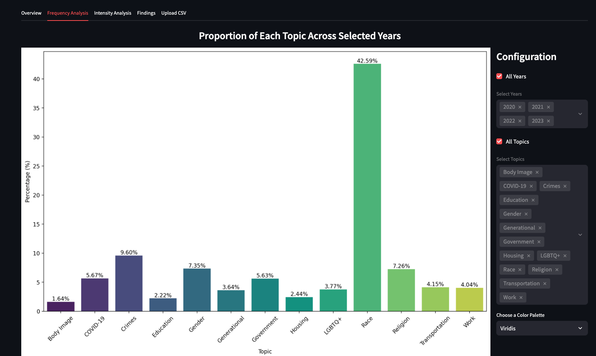

### 3.4 Intensity Analysis Tab

The Intensity Analysis section goes deeper into examining how the intensity of toxic or hateful language has shifted, displaying several visualisations for detailed analyses.

#### 3.4.1 Net Trend Visualization

Clicking into this tab displays a graphical representation of overall trends in hate and toxic speech intensity over time for the top 2 topics with the highest frequency: Race, Crimes and Gender. It helps visualize periods where speech became notably more or less hateful and toxic, offering a broader view of underlying trends.

    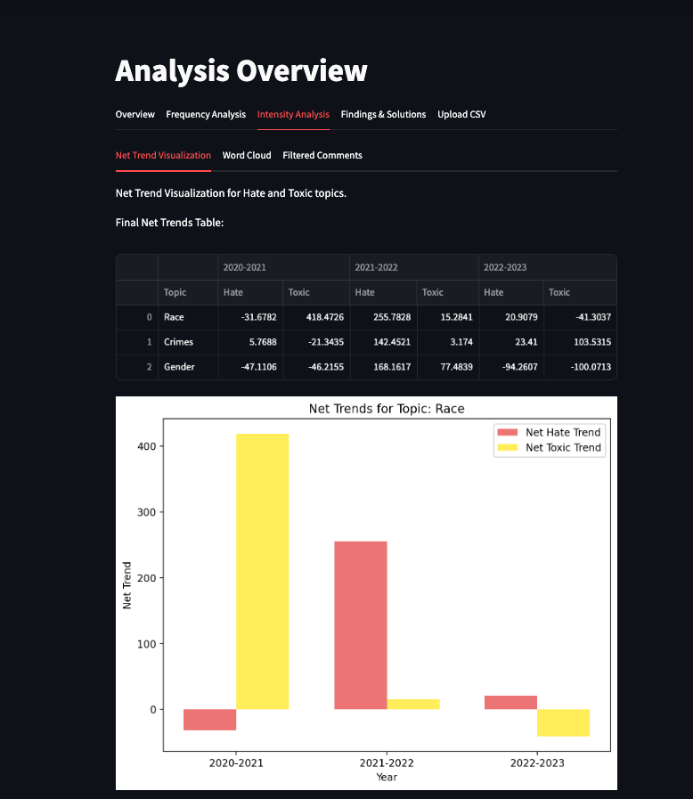

#### 3.4.2 Word Cloud

Clicking into this tab enables users to view a word cloud. It is a visual display of the most frequently occurring subjects within the top 3 topics: Race, Crime and Gender, showing that these subjects are targeted with high hatefulness/toxicity. The word cloud highlights words in proportion to their frequency, emphasizing the key subjects that are in question.

    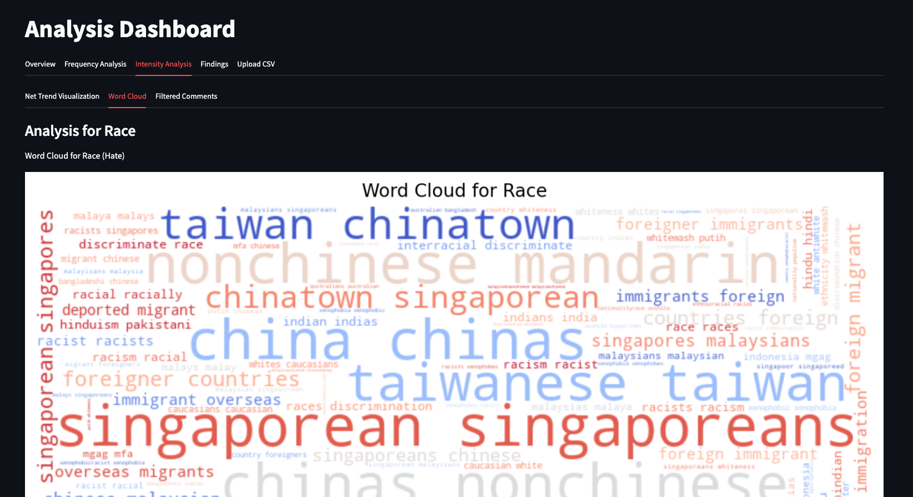

#### 3.4.3 Filtered Comments

This tab shows a list of selected comments that exist in the top 3 topics: Race, Crimes, Gender, and each of the topic's Hate and Toxic comments. Users are able to click a dropdown to choose to view the comments in any one of the six categories: Race Hate, Race Toxic, Crimes Hate, Crimes Toxic, Gender Hate, Gender Toxic.

    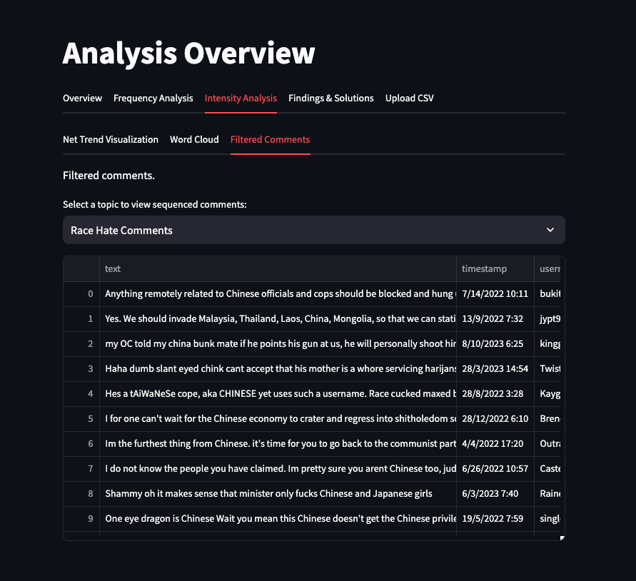

### 3.5 Findings Tab

The Findings tab presents a summary of key insights drawn from the analysis, highlighting the top three topics:Race, Crimes, and Gender, as these areas show elevated levels of hateful or toxic behavior. This section provides an in-depth look at how these topics have been discussed in Singapore-related subreddits and reflects the nuances within each topic's toxicity trends.

Key features of this tab include:

**Personalized Filtering:** Users can filter findings by specific comment types. A keyword search function also allows users to pinpoint mentions of specific terms within the findings, facilitating targeted exploration of toxic or hateful language.

**Key Insights:** For a detailed breakdown, this tab includes insights across six key categories: Race Hate, Race Toxic, Crimes Hate, Crimes Toxic, Gender Hate, and Gender Toxic. These insights allow users to better understand the context of hatefulness/toxicity within each category.

Together, these findings provide a nuanced view of the hate and toxic speech landscape, illustrating how these sentiments have evolved and pinpointing the main areas of concern.

    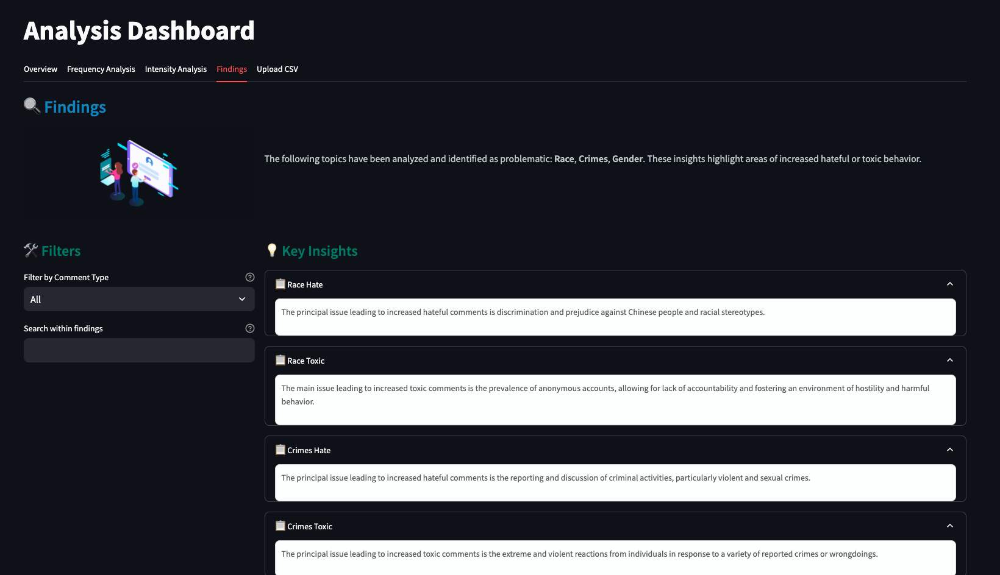

