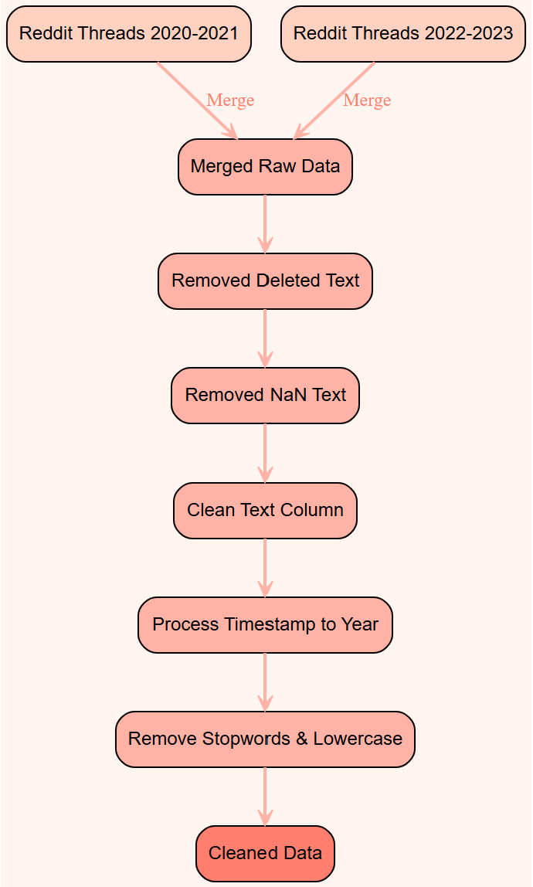

# Data Preparation

<!-- _In this subsection, you should provide a clear and detailed explanation of how your data is collected, processed, and used. Some specific parts you should explain are:_

- _Collection: What datasets did you use and how are they collected?_
- _Cleaning: How did you clean the data? How did you treat outliers or missing values?_
- _Features: What feature engineering did you do? Was anything dropped?_
- _Splitting: How did you split the data between training and test sets?_ -->

_This subsection explains how we collected, cleaned, processed, used our data, and how we utilized Kedro to manage these tasks._

## 1 Collection and Cleaning

Our data cleaning and processing involved merging two raw datasets from 2020-2023, totaling approximately 4.5 million Reddit comments. We removed rows with deleted, removed, or NaN values in the "text" column to retain only meaningful content. Next, we cleaned the text data by removing unwanted characters, extra spaces, and specific "gt" text artifacts which is a frequent result of extracting indented Reddit comments. We processed timestamps to extract the year, enabling temporal analysis. Additionally, we standardized the text by converting it to lowercase and removed common English stopwords, using [NLTK’s](https://github.com/nltk/nltk/wiki/FAQ) stopword corpus to ensure consistency. This pipeline ensured a clean, structured dataset for further classification and analysis.

### Kedro

[Kedro](https://kedro.org/) provides a structured, reproducible framework for modular data workflows while keeping data private. Using Kedro pipelines, we established a clear sequence for data processing without embedding sensitive datasets in the codebase. This setup also ensures reproducibility and transparency, allowing the project to be retraced and modified without exposing data.

## 2 Data Subsetting

After calculating the mean and median word counts of the cleaned dataset (32 and 16 words, respectively), we shuffled the data and filtered for texts between 5 and 50 words, which retained 70% of the original dataset. From this filtered data, we then randomly selected a subset of 400,000 texts.

## 3 Automated Data Labelling

### LLM selection

We automatically labelled our subset of 400,000 comments using OpenAI's GPT-4o mini LLM, which outperformed other models like Mistral-7B-Instruct-v0.3 and Meta-Llama-3-8B-Instruct in aligning with our classification definitions.Using a custom-designed base prompt, we tested each of the three models on 11 example comments covering all [7 class definitions](../../methodology/methodology.md#2----class-definitions). The prompt was refined iteratively for each model to enhance classification accuracy across all examples. Final testing yielded scores of 10 for GPT-4o mini, 10 for Llama, and 8 for Mistral. Although both GPT-4o mini and Llama achieved high scores, we chose GPT-4o mini due to its more consistent and reliable performance across diverse examples, ensuring greater alignment with our classification criteria.

| Text                                                                                                                                                                                                                                     | Mistral | Llama3  | GPT-4o mini |
| ---------------------------------------------------------------------------------------------------------------------------------------------------------------------------------------------------------------------------------------- | ------- | ------- | ----------- |
| **Hate 1**                                                                                                                                                                                                                               |         |         |             |
| teachers pushing their religious values b4 and go on a tangent and rant about LGBTQ please report them if you see that happening and feel safe enough to report. teachers doing so contravene national values such as religious harmony. | Hate 1  | Hate 2  | Hate 1      |
| **Hate 2**                                                                                                                                                                                                                               |         |         |             |
| I don't hire poor workers because they are all lazy and entitled.                                                                                                                                                                        | Hate 1  | Hate 2  | Hate 2      |
| **Toxic 1**                                                                                                                                                                                                                              |         |         |             |
| Gen Z parents gotta stop giving their child ridiculous name. They are only gonna get bullied when they go to school.                                                                                                                     | Toxic 1 | Hate 1  | Toxic 1     |
| **Toxic 2**                                                                                                                                                                                                                              |         |         |             |
| Get the fuck outta here you bloody wumao.                                                                                                                                                                                                | Toxic 2 | Hate 2  | Toxic 2     |
| **Toxic 3**                                                                                                                                                                                                                              |         |         |             |
| Indeed these aren't discriminatory. Fuck off antivaxxers, get vaccinated or get fucked.                                                                                                                                                  | Toxic 2 | Toxic 3 | Toxic 3     |

Table 1: Model Comparison on Selected Examples

### Labelling prompt

Our final prompt can be found in [`openai_generate_label.ipynb`](../../../../../../data-generation/openai/openai_generate_label.ipynb). To optimize labelling accuracy with GPT-4o mini, we aimed to balance prompt length with effectiveness, incorporating several prompt engineering techniques that significantly improved classification outcomes:

Chain-of-Thought Prompting: We structured the prompt in sequential steps to guide the model through sensitive group identification and then intensity classification. By explicitly separating each decision point (group sensitivity and language intensity), we helped the model follow a logical flow, reducing misclassification errors.

Explicit Criteria Definition: We defined each class with clear, specific criteria, particularly for "Hate" and "Toxic" classifications. This removed ambiguity, especially in nuanced comments, and enabled the model to distinguish between different levels of intensity accurately.

Examples-Based Prompting: Including labeled examples allowed GPT-4o mini to better grasp our custom classification standards. Each example was carefully selected to illustrate different class labels, giving the model concrete reference points.

Instructional Constraints: We instructed the model to classify comments "as they are," focusing only on context embedded within the comment itself and avoiding inferences from external factors, ensuring consistent application of classification rules.

### Dataset

We obtained the dataset with 400,000 texts labelled by GPT-4o mini. Table 2 shows the class distribution produced.

| Classification | Count   |
| -------------- | ------- |
| No Hate/Toxic  | 355,079 |
| Hate 1         | 22,641  |
| Toxic 1        | 15,097  |
| Toxic 2        | 5,563   |
| Hate 2         | 967     |
| Toxic 3        | 432     |
| Hate 3         | 221     |

Table 2: Class distribution of 400,000 labelled data by GPT-4o mini

We applied further preprocessing steps to this dataset before conducting [topic modelling](../modelling/model2.md) and training our [multiclass text classification model](..//modelling/model1.md).
