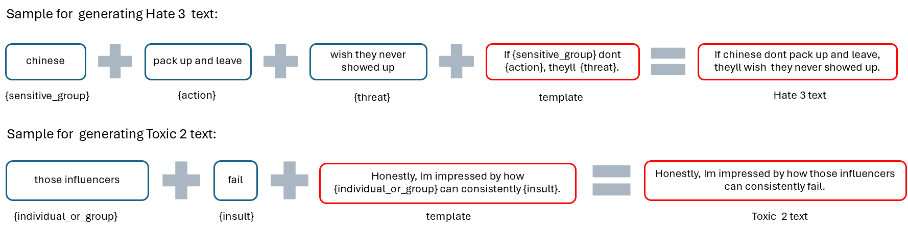

# Multiclass Text Classification

## Overview

We developed a custom multiclass text classification model tailored to encapsulate our predefined definitions of hate and toxic speech. This approach not only ensures alignment with our specific criteria but also enhances scalability by eliminating the future need to rely on external API calls for labeling, allowing us to handle datasets independently.

## 1. Data generation

The 400,000 labelled comments revealed a significant class imbalance [(Table 2)](../data-processing/index.md#dataset) with Hate 2, Hate 3, Toxic 2, and Toxic 3 having siginificantly lower counts. Initially, we addressed class imbalance by applying calculated class weights to [`CrossEntropyLoss`](https://pytorch.org/docs/stable/generated/torch.nn.CrossEntropyLoss.html) and using a stratified split for balanced training, validation, and test sets. However, DistilBERT still struggled with minority classes, so we generated synthetic data to create a fully balanced dataset, eliminating the need for class weights and significantly improving model performance.

Standard techniques like Synthetic Minority Over-sampling TEchnique [`(SMOTE)`](https://imbalanced-learn.org/stable/references/generated/imblearn.over_sampling.SMOTE.html), undersampling, and oversampling with [`imblearn`](https://imbalanced-learn.org/stable/combine.html) were applied but ineffective, as identifying hate and toxic speech in Reddit text often requires nuanced attention that these methods do not capture well. To address this, we opted to synthetically generate data for classes with fewer than 15,000 examples and randomly sampled 15,000 instances from larger classes. When we tried with a lower threshold of 5000 per class, we observed that across all models, performance was lower. We chose the 15,000 threshold ultimately to minimize the number of classes needing synthetic data, ensuring balanced representation with minimal generation. Our template-based data generation approach drew inspiration from [SGHateCheck](https://github.com/Social-AI-Studio/SGHateCheck).

We used a template-based approach to generate data for four classes—Hate 2, Hate 3, Toxic 2, and Toxic 3—tailoring each template to fit the tone and language of each class. "Hate" templates included sensitive groups and biased actions, while "Toxic" templates reflected general disrespect without targeting sensitive groups. Combining templates with action and group lists through a [Cartesian product](https://www.geeksforgeeks.org/cartesian-product-of-sets/), we created diverse, contextually relevant synthetic comments aligned with our classification definitions, enhancing model training for underrepresented classes. Although fixed templates limit flexibility, generating examples for multiclass definitions allow us to capture various forms and intensities of hate effectively.

Figure 4. Sample generation of Hate 3 and Toxic 2 example

The final dataset consisted of 105,000 labelled texts, with a balanced distribution of 15,000 texts for each of the [7 classes](../../methodology/index.md#2-class-definitions). It consists of the data labelled by GPT-4o mini and data that was synthetically generated using our templates. The dataset was split into train (70%), validation (15%), and test (15%) for us to train and evaluate Distilbert and other traditional machine learning models.

## 2. DistilBERT Model

To leverage transformer-based architecture without excessive computational cost, we selected [DistilBERT](https://huggingface.co/docs/transformers/en/model_doc/distilbert), a distilled version of [BERT](https://huggingface.co/docs/transformers/en/model_doc/bert), which provides a balance of efficiency and accuracy by retaining the core transformer architecture in a more lightweight model. DistilBERT can capture nuanced linguistic features essential for hate and toxic speech classification. The codes can be found at [`model-1/distilbert/model_1_distilbert.ipynb`](<(https://github.com/joytsy/DSA4264-Detoxify/blob/main/model-1/distilbert/model_1_distilbert.ipynb)>)

### 2.1 Data Preparation

The DistilBERT tokenizer, specifically the distilbert-base-multilingual-cased variant, captures word context and relationships, crucial for nuanced hate and toxic speech detection. It uses subword tokenization, enabling the model to handle slang, out-of-vocabulary words, and multilingual contexts commonly found in online text. We tokenized each text sample with this multilingual tokenizer, setting a maximum token length of 128 to balance context preservation and memory efficiency. Labels were mapped to integer values across seven predefined classes, and data loaders were configured with a batch size of 128 for efficient model training and evaluation.

### 2.2 Training and Hyperparameter Tuning

DistilBERT was trained over three epochs with a learning rate of 1e-5. Dropout rates were set to 0.2 for both attention and hidden layers to reduce overfitting. The AdamW optimizer with a weight decay of 0.01 was used, and a learning rate scheduler with warmup steps (10% of total training steps) was implemented to gradually adjust the learning rate during training.

### 2.3 Training Process

During each epoch, the model computed loss and accuracy across batches, with scheduler steps adjusting the learning rate. After each epoch, validation performance was evaluated, and the model with the best validation loss was saved for testing.

### 2.4 Evaluation and Testing

The best-performing DistilBERT model was then evaluated on the test set, using accuracy, loss, and weighted F1 score as metrics. F1 score was particularly important to balance precision and recall across all classes, given the inherent imbalance.

## 3. Traditional Machine Learning Models

To benchmark performance, we also employed traditional machine learning algorithms on the dataset. The codes can be found at [`model-1/classical_ml/classic_model1_15k.ipynb`](https://github.com/joytsy/DSA4264-Detoxify/blob/main/model-1/classical_ml/classic_model1_15k.ipynb)

1. [**Ridge Regression:**](https://scikit-learn.org/dev/modules/generated/sklearn.linear_model.RidgeClassifierCV.html#sklearn.linear_model.RidgeClassifierCV) Tuned with 5-fold cross-validation using [`KFold`](https://scikit-learn.org/dev/modules/generated/sklearn.model_selection.KFold.html), achieving a best alpha of 4.0.

2. [**XGBoost:**](https://xgboost.readthedocs.io/en/stable/parameter.html) An efficient and scalable implementation of gradient-boosted decision trees. Optimized with a [`grid search`](https://scikit-learn.org/dev/modules/generated/sklearn.model_selection.GridSearchCV.html), with best parameters of learning_rate=0.1, max_depth=5, n_estimators=100, and subsample=0.5.

3. [**Multinoial Naive Bayes:**](https://scikit-learn.org/dev/modules/generated/sklearn.naive_bayes.MultinomialNB.html) Used as a baseline due to computational efficiency. The algorithm is based on the Bayes theorem and is widely used for multiclass classification.

4. [**Linear Support Vector Machine:**](https://scikit-learn.org/1.5/modules/sgd.html) Included for its performance in high-dimensional spaces but with minimal tuning.

### 3.1 Preprocessing for Traditional Models

We applied tokenization, stopword removal, lemmatization, and Term Frequency-Inverse Document Frequency ([`TF-IDF`](https://scikit-learn.org/1.5/modules/generated/sklearn.feature_extraction.text.TfidfVectorizer.html)) vectorization (max 5000 features focused on unigrams) to convert text into numerical representations for traditional models. TF-IDF was chosen for its efficiency in [creating sparse, interpretable feature vectors](https://doi.org/10.1016/j.heliyon.2024.e35945) that work well with linear classifiers like Ridge and Naive Bayes. Although TF-IDF lacks contextual depth, it remains effective in capturing term importance and distinguishing words across classes, offering a suitable baseline for simpler models. Labels were mapped to integers, and the dataset was split into training, validation, and test sets using the same 70-15-15 ratio and balanced distribution applied for DistilBERT.

## 4. Evaluation

For all models, we used accuracy, loss, and macro-average [F1 score](https://scikit-learn.org/1.5/modules/generated/sklearn.metrics.f1_score.html) as evaluation metrics. The F1 score, which balances precision and recall, was critical in this project due to the multiclass nature of our task, where misclassifications across classes (even if balanced) can have different consequences. Since we had balanced the classes prior to training, we found macro-average F1-scores appropriate.
