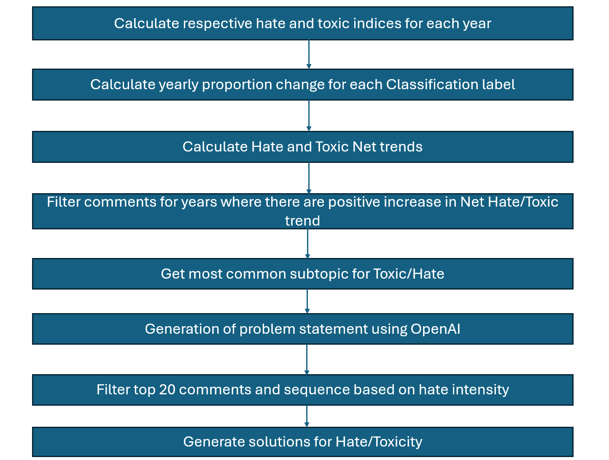

# Analyzing Reddit Data

## 1. Overview

This analysis aims to determine if and why the topics and comments on Reddit have become more hateful and toxic over recent years. To conduct this investigation, we employed a two-pronged analytical approach focusing on the frequency and intensity of toxic and hateful comments. The codes used to derive our analysis can be found [here](https://github.com/joytsy/DSA4264-Detoxify/blob/main/model-2/).

## 2. Data Processing and Topic Modeling

The primary dataset utilized consisted of comments extracted from Reddit, with text data located in the `text` column of our DataFrame. We initiated our analysis by applying a topic modeling technique using BERTopic to categorize the comments into various topics.

Figure 5. Topic Modelling Pipeline

### 2.1. Text Preprocessing and Normalization

To address the linguistic characteristics of the Reddit dataset, which includes colloquial and region-specific language known as Singlish, we implemented a preprocessing routine tailored to convert Singlish terms into standard English. This preprocessing step involved the following actions:

1. **Dictionary Mapping**: A custom dictionary was developed to translate commonly used Singlish expressions to their English equivalents, which included removing expletives and colloquialisms that could skew the analysis. This dictionary also helped standardize different spellings of similar terms (e.g., “gahmen” and “gahment” both mapped to “government”).

2. **Text Normalization**: The text data was converted to lowercase to maintain consistency in processing. Special characters were removed to clean the text of any punctuation or extraneous symbols that do not contribute to semantic meaning.

3. **Stop Words Removal**: We integrated NLTK’s list of English stop words with additional custom stop words specific to our dataset to filter out noise and focus on meaningful words.

4. **Text Cleaning Function**: A text cleaning function was developed to automate the normalization process, which involved tokenization, dictionary-based term replacement, and stop word removal. This function was applied to each text entry in the dataset.

### 2.2. Setting Up BERTopic for Topic Modeling

After preprocessing, we utilized BERTopic, an advanced topic modeling technique that leverages state-of-the-art language models and machine learning algorithms to discover topics within text data. The BERTopic setup involved several components designed to optimize topic extraction:

1. **Sentence Transformer**: The `SentenceTransformer` model, specifically `distiluse-base-multilingual-cased-v1`, was employed to generate dense vector representations of the cleaned text, capturing the contextual relationships between words.
2. **Dimensionality Reduction**: UMAP was configured to reduce the high-dimensional space of text embeddings into a lower-dimensional space that preserves the most important structural aspects of the data, facilitating more effective clustering.
3. **Clustering**: HDBSCAN was used to perform density-based clustering on the reduced embeddings, identifying groups of text with similar content without requiring a predetermined number of clusters.
4. **Representation Model**: A `KeyBERTInspired` representation model was implemented to select the most representative words for each topic based on their relevance and frequency, providing an interpretable summary of each topic.

During the topic modeling process, we identified a significant number of comments labeled with the topic identifier `-1`, indicating classification as outliers.

Upon further investigation of these outlier comments, we observed that these comments were not assigned appropriate topics during the initial topic modeling phase even though the comments were relevant. To rectify this, we opted to reassess the `-1` labeled comments by extracting the Reddit thread topic from the `linkid` column rather than relying solely on the text content. This approach allowed us to understand the context and nuances surrounding the comments, which may lack explicit thematic elements yet still contribute to the overall discourse.

## 3. Refinement of Topic Modeling

After re-evaluating the outlier comments, we conducted a secondary BERTopic modeling on the reddit thread topic. The refined topics were then merged with the previously generated topics, forming a unified dataframe that ensured comprehensive coverage and minimized information loss.

Subsequently, we categorized these topics into twelve main themes for detailed analysis:

<table>
  <tr>
    <th>#</th>
    <th>Topic</th>
  </tr>
  <tr>
    <td>1</td>
    <td>Body Image</td>
  </tr>
  <tr>
    <td>2</td>
    <td>COVID-19</td>
  </tr>
  <tr>
    <td>3</td>
    <td>Crimes</td>
  </tr>
  <tr>
    <td>4</td>
    <td>Education</td>
  </tr>
  <tr>
    <td>5</td>
    <td>Gender</td>
  </tr>
  <tr>
    <td>6</td>
    <td>Generational</td>
  </tr>
  <tr>
    <td>7</td>
    <td>Government</td>
  </tr>
  <tr>
    <td>8</td>
    <td>Housing</td>
  </tr>
  <tr>
    <td>9</td>
    <td>LGBTQ+</td>
  </tr>
  <tr>
    <td>10</td>
    <td>Religion</td>
  </tr>
  <tr>
    <td>11</td>
    <td>Transportation</td>
  </tr>
  <tr>
    <td>12</td>
    <td>Work</td>
  </tr>
  <tr>
    <td>13</td>
    <td>Race</td>
  </tr>
</table>

We leveraged BERTopic’s merging capabilities to consolidate related sub-topics under these main themes. Topics that did not align with these categories were classified as null, maintaining clarity and focus in thematic analysis.

## 4. Analysis of Hate & Toxic Frequency for Topics

Following the thematic categorization, we quantified the frequency of comments per topic to identify the most prevalent discussions. The frequency analysis aimed to pinpoint the top 3 topics that dominate the platform with regard to hate and toxicity and assess their evolution over time.

Figure 6. Frequency of hate and toxic for each topic for all years

Figure 7. Frequency of hate and toxic for each topic across each years

## 5. Analysis of Hate and Toxic Intensity for Topics

Thereafter, we dived into the respective hate and toxicity intensity trends for these 3 dominant topics from 2020 to 2023. This analysis examines hate and toxicity intensity trends across key topics by calculating trends, visualizing changes, filtering significant years, and generating insights through word clouds and problem statements.

Figure 8. Methodology for Analysis for a Topic

Our methodology involves several components to generate insights:

### 5.1. Trend Calculation

By examining the trends, we aim to provide a comprehensive view of hate and toxicity shifts over time.

1. **Calculate Indices for each Intensity Level**

   Firstly, we calculate the indices for hate and toxicity levels based on Reddit comment data. The indices are determined by analyzing the proportion of comments at each intensity level (e.g., Hate 1, Hate 2, Hate 3, Toxic 1, Toxic 2, Toxic 3) for each topic on a yearly basis. This provides a relative measure of the distribution of intensity levels over time.

- **Formula**:

1. **Find Yearly Change of Index at each Intensity Level**

   We then find out if the proportion of these indices have decreased or increased from the previous year by calculating the proportion change of indices at each intensity level.

- **Formula**:

1. **Aggregating Yearly Change in Hate and Toxic Intensities**

   For a cumulative view of whether total hate and toxicity levels have increased or decreased over time, a weighted sum formula is used. This formula sums the yearly changes in hate and toxicity indices, with higher weights given to more severe levels. This helps us determine if overall hate or toxicity levels increase in that year.

- **Formula**:

Net trends can also be visualized to track changes more easily.

Figure 9. Example of Net Hate Trend Visualisation

### 5.2. Positive Trend Filtering and Comment Extraction

Next, we focus the analysis on years that show a positive increase in the net trend for hate and toxic comments, helping to isolate periods of growing concern.

### 5.3. Subtopic Examination, Filtering and Sequencing of Comments

1. **Visualize Common Subtopics**:

   - Generate word clouds to highlight the most frequent subtopics within each main topic, using comments from years with positive trend increases (Figure 10).

1. **Filter Comments by Top Subtopic**:

   - Filter comments to focus on the top subtopic within each main topic, providing a more granular view of trending issues.

1. **Enhance Comments with Contextual Titles**:

   - Append relevant Reddit titles to each comment to add context to comments.

1. **Rank and Sequence High-Intensity Comments**:

   - Rank comments by intensity and select the top 20 for each subtopic, enabling an in-depth examination of high-intensity sentiments within the subtopic.

Figure 10. Word Cloud for Hate in Race Topic, highlighting subtopics such as 'china' and 'foreigner'.

### 5.4. Problem Statement Generation

Finally, we formulated problem statements that encapsulate the main issues within each topic with the filtered comments of highest intensity levels.

To uncover greater insights of the issues, we did literature reviews and explored possible solutions upon further examination of the problem statements. Our findings can be found [here](https://github.com/joytsy/DSA4264-Detoxify/blob/main/technical-report/docs/home/technical_report/findings.md).
