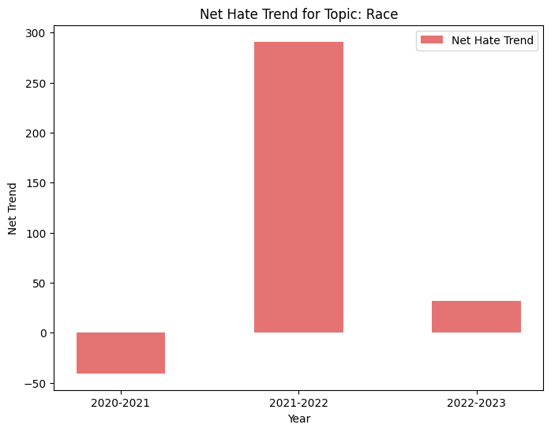

# Analyzing Reddit Data

# Analyzing Reddit Data

## 1. Overview

## 1. Overview

This analysis aims to determine if and why the topics and comments on Reddit have become more hateful and toxic over recent years. To conduct this investigation, we employed a two-pronged analytical approach focusing on the frequency and intensity of toxic and hateful comments.

## 2. Data Processing and Topic Modeling

## 2. Data Processing and Topic Modeling

The primary dataset utilized consisted of comments extracted from Reddit, with text data located in the `text` column of our DataFrame. We initiated our analysis by applying a topic modeling technique using BERTopic to categorize the comments into various topics.

Figure 5. Topic Modelling Pipeline

### 2.1. Text Preprocessing and Normalization

To address the linguistic characteristics of the Reddit dataset, which includes colloquial and region-specific language known as Singlish, we implemented a preprocessing routine tailored to convert Singlish terms into standard English. This preprocessing step involved the following actions:

1. **Dictionary Mapping**: A custom dictionary was developed to translate commonly used Singlish expressions to their English equivalents, which included removing expletives and colloquialisms that could skew the analysis. This dictionary also helped standardize different spellings of similar terms (e.g., “gahmen” and “gahment” both mapped to “government”).

2. **Text Normalization**: The text data was converted to lowercase to maintain consistency in processing. Special characters were removed to clean the text of any punctuation or extraneous symbols that do not contribute to semantic meaning.

3. **Stop Words Removal**: We integrated NLTK’s list of English stop words with additional custom stop words specific to our dataset to filter out noise and focus on meaningful words.

4. **Text Cleaning Function**: A text cleaning function was developed to automate the normalization process, which involved tokenization, dictionary-based term replacement, and stop word removal. This function was applied to each text entry in the dataset.

### 2.2. Setting Up BERTopic for Topic Modeling

After preprocessing, we utilized BERTopic, an advanced topic modeling technique that leverages state-of-the-art language models and machine learning algorithms to discover topics within text data. The BERTopic setup involved several components designed to optimize topic extraction:

1. **Sentence Transformer**: The `SentenceTransformer` model, specifically `distiluse-base-multilingual-cased-v1`, was employed to generate dense vector representations of the cleaned text, capturing the contextual relationships between words.
2. **Dimensionality Reduction**: UMAP was configured to reduce the high-dimensional space of text embeddings into a lower-dimensional space that preserves the most important structural aspects of the data, facilitating more effective clustering.
3. **Clustering**: HDBSCAN was used to perform density-based clustering on the reduced embeddings, identifying groups of text with similar content without requiring a predetermined number of clusters.
4. **Representation Model**: A `KeyBERTInspired` representation model was implemented to select the most representative words for each topic based on their relevance and frequency, providing an interpretable summary of each topic.

During the topic modelling process, we identified a significant number of comments labeled with the topic identifier `-1`, indicating classification as outliers.

Upon further investigation of these outlier comments, we observed a that these comments were not assigned appropriate topics during the initial topic modeling phase even though the comments were relavant. To rectify this, we opted to reassess the `-1` labeled comments by extracting the Reddit thread topic from the `linkid` column rather than relying solely on the text content. This approach allowed us to understand the context surrounding the comments, which may lack explicit thematic elements yet still contribute to the overall discourse.

## 3. Refinement of Topic Modeling

After re-evaluating the outlier comments, we integrated these findings with the previously identified topics into a unified dataframe. This integration process involved combining the refined `-1` topics with the existing topic classifications to ensure comprehensive coverage of the dataset.

Subsequently, we categorized these topics into twelve main themes for detailed analysis:

1. Body Image
2. COVID-19
3. Crimes
4. Education
5. Gender
6. Generational
7. Government
8. Housing
9. LGBTQ+
10. Religion
11. Transportation
12. Work
13. Race

We leveraged BERTopic’s merging capabilities to consolidate related sub-topics under these main themes. Topics that did not align with these categories were classified as null, maintaining clarity and focus in thematic analysis.

## 4. Analysis of Hate & Toxic Frequency for Topics

Following the thematic categorization, we quantified the frequency of comments per topic to identify the most prevalent discussions. The frequency analysis aimed to pinpoint the top 3 topics that dominate the platform with regard to hate and toxicity and assess their evolution over time.

Figure 6. Frequency of hate and toxic for each topic for all years

Figure 7. Frequency of hate and toxic for each topic across each years

## 5. Analysis of Hate and Toxic Intensity for Topics

Thereafter, we dived into the respective hate and toxicity intensity trends for these 3 dominant topics from 2020 to 2023. This analysis examines hate and toxicity intensity trends across key topics by calculating trends, visualizing changes, filtering significant years, and generating insights through word clouds and problem statements.

    

    Figure 8. Methodology for Intensity Analysis for a Topic

Our methodology involves several components to generate insights:

### 5.1. Trend Calculation

Trend calculation consists of multiple functions that work together to create a cumulative view of hate and toxicity trends over time.

1. **`calculate_indices`**

   - **Purpose**: This function establishes baseline indices for hate and toxicity by analyzing the proportion of each intensity level of comments (e.g., Hate 1, Hate 2, Hate 3, Toxic 1, Toxic 2, Toxic 3) for each topic on a yearly basis.
   - **Process**: The hate and toxic indices are calculated by determining the proportion of comments at each intensity level for hate or toxic categories within a specific year. This is done by dividing the number of comments at a given intensity level for that year by the total number of hate or toxic comments for all years within the topic. This calculation provides a relative measure of intensity distribution for each year.
   - **Formula**:

   \[
   \text{Index for a specific level} = \frac{\text{Number of comments at that intensity level for the year}}{\text{Total number of hate or toxic comments for all years in the topic}}
   \]
   Example for **Hate 3 Index in 2021**:

   \[
   \text{Hate 3 Index (2021)} = \frac{\text{Hate 3 comments in 2021}}{\text{Total hate comments (2020–2023)}}
   \]

1. **`calculate_trend_data`**

   - **Purpose**: This function processes the DataFrame of indices generated by the `calculate_indices` function to create a time series that reflects the changes in hate and toxicity levels from one year to the next.
   - **Process**: It calculates the yearly change in the hate and toxicity indices, tracking how the proportion of comments at different intensity levels evolves over time. The function helps identify trends, such as whether hate or toxicity has increased or decreased from one year to the next for each intensity level.
   - **Formula**:

   \[
   \text{Percentage Change in Hate 3 Index} = \frac{\text{Hate 3 Index (Current Year)} - \text{Hate 3 Index (Previous Year)}}{\text{Hate 3 Index (Previous Year)}} \times 100
   \]

   Example for Hate 3 Change from 2020 to 2021:

   \[
   \text{Percentage Change in Hate 3 Index} = \frac{\text{Hate 3 Index (2021)} - \text{Hate 3 Index (2020)}}{\text{Hate 3 Index (2020)}} \times 100
   \]

1. **`calculate_net_trends`**

   - **Purpose**: This function aggregates the trend data calculated in `calculate_trend_data` to determine the cumulative net change in hate and toxicity intensity levels. It creates a single metric that summarizes whether hate or toxic levels have increased or decreased from one year to the next.
   - **Process**: The function sums the individual changes in the indices for different intensity levels to calculate an overall net change for each year. The output is `final_trend_df`.
   - **Formula**:

   \[
   \text{Net Hate Index} = (\text{Change in Hate 3 Index} \times 3) + (\text{Change in Hate 2 Index} \times 2) + (\text{Change in Hate 1 Index} \times 1)
   \]

   Example for **Net Change in Hate from 2020 to 2021**:

   \[
   \text{Net Hate Index 2020-2021} = (\text{Change in Hate 3 Index 2020-2021} \times 3) + (\text{Change in Hate 2 Index 2020-2021} \times 2) + (\text{Change in Hate 1 Index 2020-2021} \times 1)
   \]

Net trends can also be visualized using the function `plot_net_trends(final_trend_df)`.

Figure 9. Example of Net Hate Trend Visualisation

### 5.2. Positive Trend Filtering and Comment Extraction

This section serves to focus our analysis on the years with positive trends in intensity.

1. **`filter_positive_years`**:

   - **Purpose**: Identifies years where there has been a positive increase in the net trend for hate or toxic comments.

2. **`get_comments_for_positive_years`**:
   - **Purpose**: Filters and extracts comments from the `positive_trend_df`, focusing on years where hate or toxic intensity has significantly increased.

### 5.3. WordCloud Generation and Filtering and Sequencing of Comments

This step refines the focus to narrower subtopics within the broader topics, aiming to uncover specific insights related to increasing intensity trends.

1. **`generate_wordcloud`**:

   - **Purpose**: Creates a visual word cloud for a specified topic using the filtered comments from `get_comments_for_positive_years`, enabling visualization of the most common subtopics within the broader topics.

   

   

   Figure 10. Word Cloud for Hate in Race Topic, highlighting subtopics such as ‘china’ and ‘foreigner’

   

1. **`filter_and_sequence_comments`**:
   - **Purpose**: Identifies and analyzes the most common subtopics within larger topics, providing targeted insights into specific areas. This function focuses on high-intensity comments, laying the groundwork for problem statement generation.
   - **Process**:
     - The function begins by identifying the most frequent subtopic within each topic based on the initial BERTopic classification, using the `Topic_Words` column to determine relevance.
     - It filters the DataFrame for the identified subtopic and sorts comments by intensity level, prioritizing those with the highest levels of hate or toxicity
     - The function also extracts the Reddit title from the `link` column and appends it to each comment to offer additional context during problem statement generation.
     - Finally, it ranks and selects the top 20 most intense comments, facilitating an in-depth examination of high-intensity sentiments within the specific subtopic.

### 5.4. Problem Statement Generation

- **`solutions.ipynb`**:
  - **Purpose**: This Jupyter notebook processes the filtered and sequenced comments to formulate problem statements that encapsulate the main issues within each topic.
  - **Process**: Utilizes an OpenAI API call to generate problem statements, drawing from the top comments, subtopics, and contextual data derived from the `filter_and_sequence_comments` function.
  - **Output**: Contextualized problem statements that highlight the key issues for each topic

We then further went on to examine the problem statements and did literature reviews on them to uncover greater insights and explore possible solutions.
