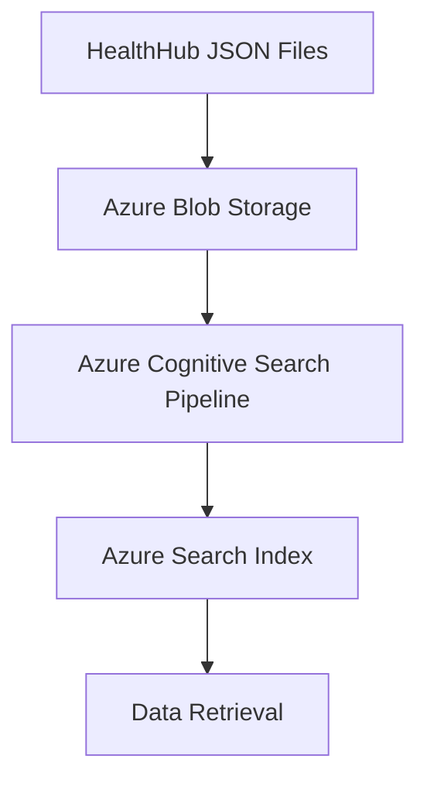

# Azure Search Index

## Introduction

This documentation describes the process of ingesting HealthHub articles into the Azure Search Index using Azure Blob Storage, the `azure_rag` pipeline for chunking and embedding, and eventual data retrieval for your application. The articles are ingested in JSON format and go through several stages, including document upload, chunking, embedding, and retrieval.

## Overview

This project involves the ingestion of articles from HealthHub into an Azure Search Index to enable efficient and scalable search capabilities. The system leverages various Azure services such as Blob Storage, Azure Cognitive Search, and Azure OpenAI for embedding.

The high-level architecture includes:

- Uploading HealthHub articles (in JSON format) to Azure Blob Storage.
- Utilizing an Azure Cognitive Search pipeline to chunk the articles and generate embeddings using Azure OpenAI.
- Storing the chunks and embeddings in Azure Search Index for semantic and full-text search.

For more details, refer to:

- [JSON Data Preparation]
- [Data Ingestion]
- [Search Index]
- [Skillset]

---

## Architecture

The diagram below shows a high level overview on how the services and components interact with each other.

| Step                                | Description                                                                                                         |
| ----------------------------------- | ------------------------------------------------------------------------------------------------------------------- |
| **HealthHub JSON Files**            | JSON files containing article data, with fields like `id`, `title`, `content_category`, and `content`.              |
| **Azure Blob Storage**              | Upload JSON files to Azure Blob Storage for persistent storage.                                                     |
| **Azure Cognitive Search Pipeline** | Azure Cognitive Search pipeline responsible for indexing the data into the Azure Search Index.                      |
| **Azure Search Index**              | The chunks and their embeddings are stored in the Azure Search Index, allowing for various types of search queries. |
| **Data Retrieval**                  | The final step where data can be queried and retrieved through several types of search.                             |

---

## Version History

The following versions detail the evolution of the ingestion process, addressing various issues:

- **V1**: Ingestion in txt files.
- **V2**: Ingestion in json files but with 2048 max page length and 20 page overlap (Resolve metadata issue)
- **V3**: Ingestion of article content and table content (Resolve lack of table content)
- **V4**: Ingestion in json files but with 5000 max page length and 20 page overlap (Resolve content cut-off issue)
- **V5**: Ingestion in json files but with 5000 max page length and 200 page overlap (Resolve lack of understanding between chunks)
- **V6**: Additional article content extracted from programs and sub-program pages. (Resolve the lack of programs and sub-program pages content)
- **V7**: Added 2 javascript articles to supplement the article content. (Resolve the missing content from the javascript from the programs and sub-program pages articles)
